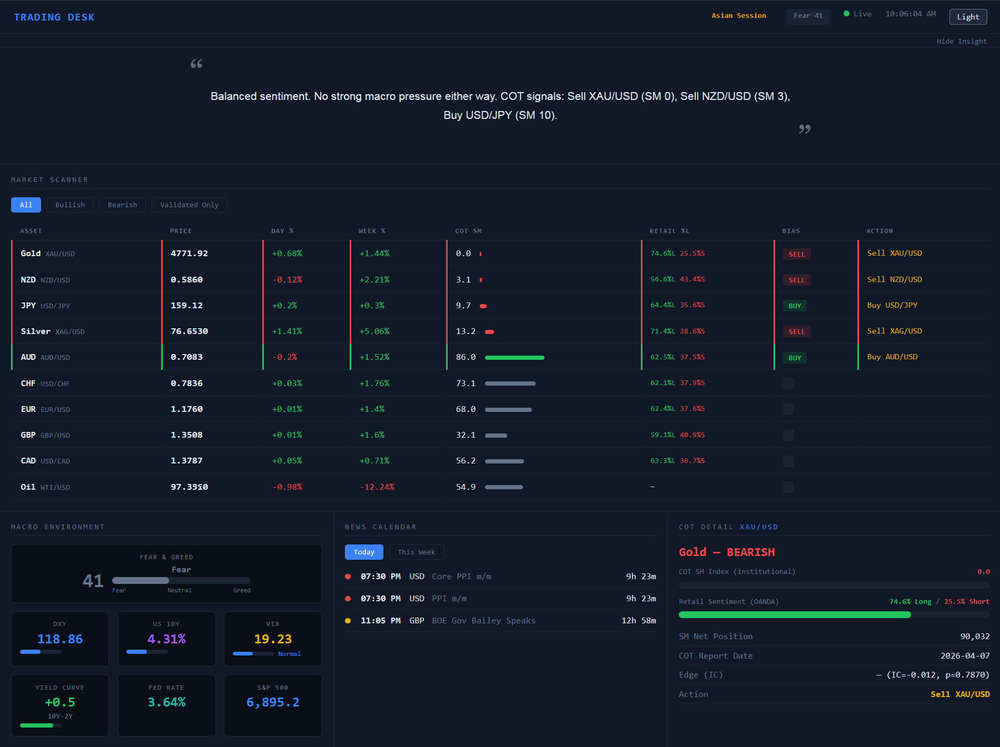
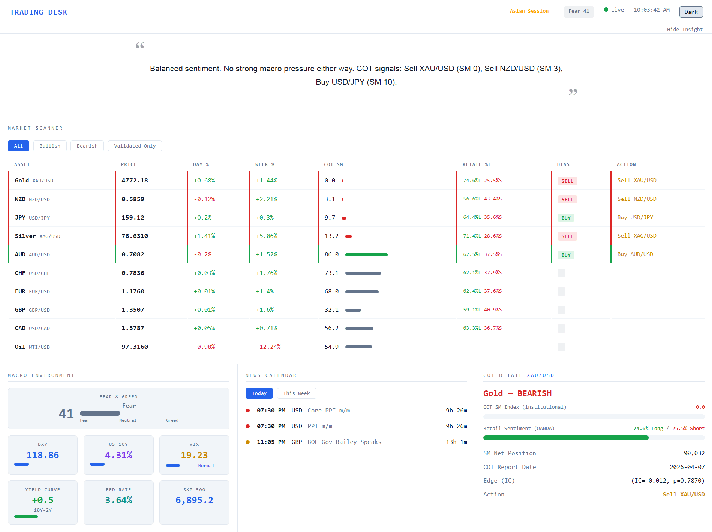

# Macro COT Scanner

Real-time pre-market scanner for intraday traders. Aggregates COT positioning, macro data, retail sentiment, economic calendar, and market fear/greed into a single dashboard.


| Dark Theme | Light Theme |
|:---:|:---:|
|  |  |

## Features

- **Market Scanner** — 10 instruments (6 FX + Gold, Silver, Oil, NZD) with live prices, daily/weekly change, COT bias
- **COT Smart Money Index** — CFTC Commitment of Traders data, normalized 0-100 with 52-week lookback
- **Macro Environment** — DXY, US10Y, Yield Curve, VIX, Fed Rate, S&P 500 (FRED + OANDA)
- **CNN Fear & Greed Index** — Real-time market sentiment from CNN's authoritative source
- **OANDA Retail Sentiment** — Position book data showing retail long/short ratios
- **Economic Calendar** — This week's events from ForexFactory (faireconomy API), filterable by Today/Week
- **Market Insight** — Auto-generated actionable summary based on current data
- **Dark/Light theme** — Persisted in localStorage

## Data Sources

| Source | Data | Update Frequency |
|--------|------|-----------------|
| OANDA | Prices, spreads, sentiment, SPX | 3 seconds |
| CFTC | COT reports (disaggregated + financial) | Weekly (Friday) |
| FRED | DXY, US10Y, US02Y, VIX, Fed Funds | 30 minutes |
| CNN | Fear & Greed Index | 30 minutes |
| faireconomy | Economic calendar | 60 seconds |

## No Arbitrary Thresholds

All thresholds in this dashboard come from authoritative sources:
- **VIX levels** (Calm/Normal/Elevated/Fear) — CBOE standard
- **Yield Curve inversion** (<0) — universally accepted warning signal
- **COT extremes** (>75 bullish, <25 bearish) — standard percentile-based
- **Fear & Greed** — CNN's official index, not self-calculated

DXY and US10Y show values only, with no strong/weak labels — what counts as "high" depends on the macro era.

## Setup

### 1. Clone
```bash
git clone https://github.com/joeytran369/macro-cot-scanner.git
cd macro-cot-scanner
```

### 2. Install dependencies
```bash
pip install -r requirements.txt
```

### 3. Configure API keys
```bash
cp .env.example .env
# Edit .env with your keys
```

You need:
- **OANDA API token** — free demo account at [oanda.com](https://www.oanda.com/demo-account/)
- **FRED API key** — free at [fred.stlouisfed.org](https://fred.stlouisfed.org/docs/api/api_key.html)

### 4. Run
```bash
python server.py
```

Open `http://localhost:8888` in your browser.

### 5. (Optional) Run as systemd service
```bash
sudo cp trading-desk.service /etc/systemd/system/
sudo systemctl enable trading-desk
sudo systemctl start trading-desk
```

## Architecture

```
server.py          FastAPI backend — data fetchers + WebSocket + REST API
static/index.html  Single-page frontend — vanilla JS, no build step
lib/cot.py         CFTC COT data fetcher + COT Index calculator
tests/             pytest suite
data/              Cache directory (COT CSVs, news cache)
```

- **WebSocket** pushes live data every 3 seconds
- **HTTP polling fallback** if WebSocket fails (e.g. behind a proxy that doesn't support WS)
- COT data cached to disk to avoid re-downloading ~10 years of CFTC reports

## COT Edge Validation

The COT Smart Money Index has been validated using Information Coefficient (IC) analysis on 10+ years of data:

| Pair | IC | p-value | Edge |
|------|-----|---------|------|
| EUR/USD | 0.173 | 0.0001 | High |
| USD/CAD | -0.201 | 0.0000 | High |
| AUD/USD | -0.119 | 0.007 | High |
| USD/CHF | 0.142 | 0.037 | Med |
| GBP/USD | -0.026 | 0.567 | — |
| USD/JPY | -0.030 | 0.488 | — |

Gold, Silver, Oil, NZD: no statistically significant edge from COT alone.

## Tests

```bash
pytest tests/ -v
```

## License

MIT

## Author

**Joey Tran** — [@joeytran369](https://github.com/joeytran369)
